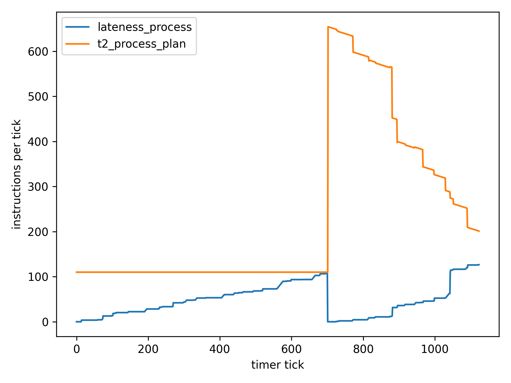

# Prediction Failure Handling Simulation

## Overview

This simulation is part of a master thesis that is concerned with designing and implementing a prediction failure handling component. The code in this project was primarily used to understand the behaviour of different prediction failure handling approaches. The details of the proposed design are explained in detail in the thesis, which can be found [TODO_link](todo).

## Run it
### Dependencies
The simulation uses no dependencies, except numpy and matplotlib. Using pip, both modules can be installed with the following line:

    sudo pip3 install numpy matplotlib

### Configuration

In order to be able to run the simulation, the base directory has to be set in **config.py**:

    PROJECT_BASE: str = "/home/ml/Dropbox/Master-Arbeit/code/threshold_simulation"

### Makefile

Using the **Makefile**, the project can be run in four different ways:

1. `make run`: Runs the simulation using the plan saved in `logs/plan.log`
1. `make run_new`: Generates a new plan and runs it
1. `make vis`: Uses the current files in `logs` and generates a visualization corresponding to the previous logged run
1. `make run_vis`: Combines `run` and `vis`

## Example run

The behaviour of the prediction failure handling component can be modified by changing the values in **config.py**. Per default, the simulation only logs relevant events to stdout:

    [484371132][preemption] task 5 was preempted 1 times
    [484371145] finished Task 6; started Task 5
    [484371146] finished Task 5; started Task 7
    [484371196] finished Task 7; started Task 8
    [484371240][preemption] task 8 was preempted 1 times
    [484371241] finished Task 4; started Task 9
    [484371246] finished Task 9; started Task 8
    [484371247] finished Task 8; started Task 10
    [779282642] idling

The first number in this format is the number of ticks run.

The simulation also creates a per-tick log in `logs/unified_tick.log` that contains more details:

    tick:1;t1_sum:253825026;t1_pure:23075002;t2_task_sum:380750024;t2_task_pure:150000000;t2_process_capacity:23075002;t2_process_plan:1500000000;t2_node:4500000000;tm2_task_sum:80750024;tm2_task_pure:-150000000;tm2_node:-4725000000;cur_task_id:0;cur_task_len_unchanged:230750024;cur_task_len_plan:220750024;cur_task_len_real:244294728;lateness_task:0;preemptions:0;process_id:1;lateness_process:0;lateness_node:0
    tick:2;t1_sum:253825026;t1_pure:23075002;t2_task_sum:380750024;t2_task_pure:150000000;t2_process_capacity:23075002;t2_process_plan:1500000000;t2_node:4500000000;tm2_task_sum:80750024;tm2_task_pure:-150000000;tm2_node:-4725000000;cur_task_id:0;cur_task_len_unchanged:230750024;cur_task_len_plan:210750024;cur_task_len_real:234294728;lateness_task:0;preemptions:0;process_id:1;lateness_process:0;lateness_node:0
    tick:3;t1_sum:253825026;t1_pure:23075002;t2_task_sum:380750024;t2_task_pure:150000000;t2_process_capacity:23075002;t2_process_plan:1500000000;t2_node:4500000000;tm2_task_sum:80750024;tm2_task_pure:-150000000;tm2_node:-4725000000;cur_task_id:0;cur_task_len_unchanged:230750024;cur_task_len_plan:200750024;cur_task_len_real:224294728;lateness_task:0;preemptions:0;process_id:1;lateness_process:0;lateness_node:0
    tick:4;t1_sum:253825026;t1_pure:23075002;t2_task_sum:380750024;t2_task_pure:150000000;t2_process_capacity:23075002;t2_process_plan:1500000000;t2_node:4500000000;tm2_task_sum:80750024;tm2_task_pure:-150000000;tm2_node:-4725000000;cur_task_id:0;cur_task_len_unchanged:230750024;cur_task_len_plan:190750024;cur_task_len_real:214294728;lateness_task:0;preemptions:0;process_id:1;lateness_process:0;lateness_node:0
    tick:5;t1_sum:253825026;t1_pure:23075002;t2_task_sum:380750024;t2_task_pure:150000000;t2_process_capacity:23075002;t2_process_plan:1500000000;t2_node:4500000000;tm2_task_sum:80750024;tm2_task_pure:-150000000;tm2_node:-4725000000;cur_task_id:0;cur_task_len_unchanged:230750024;cur_task_len_plan:180750024;cur_task_len_real:204294728;lateness_task:0;preemptions:0;process_id:1;lateness_process:0;lateness_node:0
    tick:6;t1_sum:253825026;t1_pure:23075002;t2_task_sum:380750024;t2_task_pure:150000000;t2_process_capacity:23075002;t2_process_plan:1500000000;t2_node:4500000000;tm2_task_sum:80750024;tm2_task_pure:-150000000;tm2_node:-4725000000;cur_task_id:0;cur_task_len_unchanged:230750024;cur_task_len_plan:170750024;cur_task_len_real:194294728;lateness_task:0;preemptions:0;process_id:1;lateness_process:0;lateness_node:0
    ...

Since this format is not easy for humans to read, the visualization contains a parser, that creates an object of **TickEvent** for each line. The class is defined in **log_parser.py**. Looking at ticks with the help of a debugger might be more convenient than looking at the log-file directly. 

The following visualization depicts the development of the process lateness compared to `t2_process`:

Since the test scenario only included only short running processes with a bias towards lateness, the value of `t2_process` is that of `config.T2_PROCESS_MINIMUM`. Near timer tick 700, the process transgresses on `t2_process` and causes a rescheduling. Due to the stress system, `t2_process` is heavily increased, but slowly returns to its base value.
